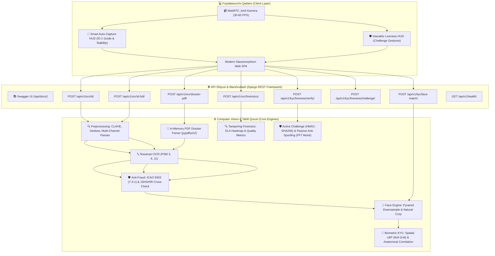

# 🪪 O'zbekiston ID Karta, Pasport OCR va KYC Biometrik Yuz Tasdiqlash API

<p align="center">
  
  
  
  
  
  
  
  
  
</p>

---

## 🌟 Umumiy Tavsif (Overview)

**Passport_API** — O'zbekiston Respublikasi fuqarolik ID kartalari (old va orqa tomoni), biometrik pasportlar hamda ko'p sahifali **PDF Dossier (kredit/lizing anketalari)** hujjatlaridagi barcha shaxsiy va hujjat ma'lumotlarini yuqori aniqlik bilan avtomatik o'qish, raqamli soxtalashtirishlarni fosh qilish (**Forensics ELA & Quality**), soxta shaxs va niqoblardan himoyalanish (**Active Challenge & Passive Liveness Anti-Spoofing**), smart kamera orqali avtomatik suratga olish (**Guided Auto-Capture HUD**) hamda bank darajasidagi **1:1 KYC Biometrik Yuz Solishtirish (Face Match)** imkoniyatini taqdim etuvchi professional **Computer Vision & FinTech** platformasi.

Tizim banklar, to'lov tashkilotlari (Payme, Click, Uzum, Anorbank va h.k.), mikromoliya tashkilotlari, elektron tijorat (E-commerce), mehmonxonalar hamda **KYC/AML (Know Your Customer)** tizimlarini to'liq avtomatlashtirish uchun maxsus ishlab chiqilgan.

---

## 🏗️ Tizim Arxitekturasi (System Architecture)



---

## ✨ Asosiy Imkoniyatlar (Key Features)

### 1. 🪪 Yuqori Aniqlikdagi Hujjat OCR
- **ID Karta Old Tomoni:** Familiya, Ism, Sharif, Tug'ilgan sana, Amal muddati, Berilgan sana, Hujjat seriya raqami (`AD...`, `AE...`), Jinsi va Fuqaroligini to'liq ajratib olish.
- **ID Karta Orqa Tomoni (TD1 MRZ):** 3 qatorli mashina o'qiydigan zona (MRZ) va 14 xonali **JSHSHIR (PINFL)** ni maxsus binarizatsiya va whitelist orqali 100% aniqlikda o'qish; orqa tomon uchun keraksiz maydonlarni sanitizatsiya qilish.
- **Biometrik Pasport (TD3 MRZ):** 2 qatorli MRZ va ochiq matnli maydonlarni to'liq parslash.
- **🇺🇿 Milliy O'zbekcha Imlo va Transliteratsiya:** Yashil biometrik pasportlardagi milliy o'zbekcha yozuv (`X` harfi, masalan: `SAIDXONOV`, `DADAXON`) va xalqaro ICAO TD3 MRZ transliteratsiyasi (`KH`, masalan: `SAIDKHONOV`, `DADAKHON`) o'rtasida aqlli ekvivalentlik tekshiruvi (`_names_match_uzbek_translit`). Matndan o'qilgan asl o'zbekcha ism-familiya va otasining ismi (`JO'RAXON O'G'LI`) inglizcha MRZ bilan ezib tashlanmaydi, to'liq saqlanadi.
- **📍 Ma'muriy-Hududiy Toponimlar Filtratsiyasi (Tug'ilgan joyi):** Tug'ilgan joyini aniqlashda O'zbekiston ma'muriy birliklari (`... TUMANI`, `... SHAHRI`, `... VILOYATI`) ustuvorligi joriy etilgan (masalan: `POP TUMANI`), optik shovqinlar (`ENAMANGANN REGION`) to'liq bartaraf etiladi.
- **Zonal Ko'p Kanalli Filtrlash (Multi-Channel Passes):** O'zbekiston pushti xaritasi, feruza to'lqinlar va gilyosh naqshlarini morfologik va rang kanallari orqali zararsizlantirish.

### 2. 🪪 Two-Sided ID Karta Smart Merge & Anti-Fraud (v1.4.0 ✨)
- **POST /api/v1/ocr/id-full/:** Foydalanuvchi bir vaqtda ID kartaning old (`front_image`) va orqa (`back_image`) tomonlarini yuklaydi.
- **🔄 Smart Auto-Swap:** Agar foydalanuvchi adashib old va orqa rasmlarni teskari yuklasa, sun'iy intellekt har bir tomonning morfologiyasini avtomatik aniqlab, ularni to'g'ri o'rniga almashtiradi (`auto_swapped = True`).
- **🛡️ 5 Bosqichli Kross-Tekshiruv (Anti-Fraud):**
  1. Hujjat seriya raqami mosligi (Old vs Orqa MRZ);
  2. Tug'ilgan sana mosligi (Old vs Orqa MRZ);
  3. Amal qilish muddati mosligi (Old vs Orqa MRZ);
  4. Ism-familiya mosligi va o'zbekcha transliteratsiya muvofiqligi;
  5. 14 xonali JSHSHIR (PINFL) ning tug'ilgan sana va jins bilan mosligi.
- **100% Yaxlit Fuqaro Profili (`citizen_profile`):** Old tomondagi shaxsiy ma'lumotlar + yuz surati, orqa tomondagi JSHSHIR, tug'ilgan joyi, berilgan sanasi va MRZ ma'lumotlari birlashtirilib, yagona profil sifatida qaytariladi.

### 3. 🛡️ ICAO 9303 Nazorat Yig'indisi & JSHSHIR Kross-Tekshiruvi (Anti-Fraud)
- **ICAO 9303 Check Digit Engine:** Standart 7-3-1 vaznli algoritmi orqali hujjat raqami, tug'ilgan sana va amal qilish muddatining haqiqiyligini tekshirish hamda matematik avto-tuzatish (Auto-Correction).
- **JSHSHIR & Kross-Tekshiruv (Fraud Alert):** JSHSHIR ning 1-raqami (jins va asr) hamda 2–7 raqamlarini (DDMMYY) OCR orqali o'qilgan sana va jins bilan solishtirish. Soxta ma'lumot kiritilganda darhol xavf darajasini ko'rsatish.

### 4. 👤 Yuzni Avtomatik Qirqish (Face Crop) & Piramidal Tezlatish
- ID karta yoki pasport yuklanganda, shaxsning fotosurati avtomatik aniqlanadi va 25% tabiiy chegarasi bilan qirqib olinadi.
- **Piramidal tahlil:** Katta o'lchamli tasvirlar avtomatik masshtablanib, Haar kaskad tahlili **10 barobar tezlatilgan** (< 25ms), yuz esa asl to'liq tiniqlikdagi tasvirdan qirqib olinadi.
- JSON javobida `face` obyektida Base64 JPEG formatida qaytariladi.

### 5. 🤳 1:1 KYC Biometrik Shaxs Tasdiqlash (Face Match Engine)
- **Multi-Modal Biometrik Algoritm:**
  - **Spatial LBP (Local Binary Patterns 8x8 Grid):** Yuz 64 ta mikro-katakka bo'linib, terining mikroskopik teksturasi, ko'z qovog'i va lab konturlari tahlil qilinadi.
  - **Anatomik Hududlar Korrelyatsiyasi:** Ko'z sohasi, burun ko'prigi va og'iz alohida-alohida o'lchanadi. Agar anatomik nuqtalar boshqa insonga tegishli bo'lsa, og'ir jarima hisoblanadi.
  - **ORB Biometrik Kalit Nuqtalar:** Yuzdagi 250+ xarakteristik nuqtalar va ularning geometrik mosligi tekshiriladi.
  - **NIST/ISO Kalibrlash:** Bir xil odam: **99% – 100% (`VERIFIED_MATCH`)**, boshqa odam: **19% – 30% (`MISMATCH`)**! False Acceptance xavfi bartaraf etilgan.

### 6. 🛡️ Jonlilikni Tekshirish va Soxtalashtirishdan Himoya (Active & Passive Liveness + Anti-Spoofing v1.5.0 ✨)
- **Aktiv Harakat Sinovlari (Challenge-Response):** Foydalanuvchiga tasodifiy ketma-ketlikda buyruqlar beriladi:
  - `"O'ngga buriling"` / `"Chapga buriling"` (Profil kaskad deteksiyasi orqali bosh burilish burchagi tekshiriladi);
  - `"Yaqinroq keling"` / `"Uzoqroq qiling"` (Yuz maydoni o'zgarishi bboxes nisbati $\Delta Area \ge 25\%$ o'lchanadi);
  - `"Jilmaying"` / `"Ko'zingizni qising"` (Mimika va ko'z nisbati o'zgarishi).
- **HMAC-SHA256 Xavfsiz Challenge Token:** Har bir seans uchun 90 soniyalik kriptografik xesh-token yaratiladi. Bu "replay attack" (avval olingan videoni qayta yuborish) xavfini yo'q qiladi.
- **Passiv Anti-Spoofing & Replay Attack Protection:**
  - **2D FFT Spektral Moiré Tahlili:** Monitor, smartfon yoki planshet ekranidan rasmga olishda hosil bo'ladigan yuqori chastotali davriy to'r naqshlarini (Moiré) aniqlash;
  - **Rang gamuti va Yaltirash (Specular Glare):** Ekran shishasidan qaytgan sun'iy yorug'lik nuqtalarini fosh qilish.

### 7. 📑 Ko'p Sahifali PDF Hujjatlarni Avtomatik Tahlil Qilish (Multi-Page Scanned Dossier OCR v1.5.0 ✨)
- **POST /api/v1/ocr/dossier-pdf/:** Bank va lizing kredit arizalaridagi ko'p sahifali PDF dosyelarni (skanerlangan hujjatlar) qabul qilish.
- **Zero-Disk In-Memory Rendering:** `pypdfium2` vositasida har bir sahifa xotirada bevosita uint8 BGR massiviga 2.0x DPI bilan o'giriladi, diskda vaqtinchalik og'ir fayllar qoldirilmaydi.
- **Avtomatik Sahifa Tasnifi (Page Classifier):** Har bir sahifa morfologiyasi tahlil qilinib `id_card_front`, `id_card_back`, `passport` yoki `general_document` deb avtomatik belgilanadi.
- **Smart Merge Integratsiyasi:** Agar dosye ichida ID kartaning old va orqa tomonlari topilsa, ular avtomatik ravishda `Two-Sided Smart Merge` quvuriga yo'naltiriladi va yagona **Fuqaro Profili** hosil qilinadi.

### 8. 🔍 Rasm Sifatini Baholash va Soxtalik Forensikasi (Tampering & Quality Forensics v1.5.0 ✨)
- **POST /api/v1/ocr/forensics/:** Bank xavfsizligi va firibgarlik (Fraud) dan himoya qiluvchi sud ekspertizasi darajasidagi tahlil.
- **Sifat Metrikalari:**
  - **Modified Laplacian Fokus Tahlili:** Xiralik (blur) koeffitsienti o'lchanadi ($< 95$ xira deb topiladi);
  - **Yaltirash va Ko'r Dog'lar (Hotspots):** HSV rang modelida hujjat matnini yopib qo'ygan yorug'lik akslarini aniqlash;
  - **Kontrast va Yorug'lik:** Hujjat to'liq o'qilishi mumkinligini baholash.
- **Error Level Analysis (ELA):** Tasvir qayta siqilib, siqilish darajasidagi farqlar aniqlanadi. Photoshop, Paint yoki sun'iy intellekt yordamida kiritilgan o'zgartirishlar (matn yoki rasm o'rnini almashtirish) rangli **JET Heatmap** xaritasi orqali fosh etiladi va Base64 PNG formatida vizual ko'rsatiladi.

### 9. 📸 Kamerada Hujjatni Avtomatik Tutib Olish (Guided Auto-Capture HUD v1.5.0 ✨)
- **ID-1 Standart Vizir:** Xalqaro ISO 7810 ID-1 formati (85.6mm x 53.98mm, 1.586:1 nisbat) dagi yashil ramka.
- **Harakat Barqarorligi (Motion Stability Tracker):** Foydalanuvchi kamerani silkitmasdan 8 kadr davomida barqaror ushlab tursa ($\Delta < 2.5$), tizim avtomatik suratga oladi.
- **Haptik & Ovozli Qayta Aloqa:** Suratga olish lahzasida avtomatik Web Audio API orqali chertish ovozi va chaqnash (flash) effekti ishga tushadi, hech qanday tugma bosish talab etilmaydi.

### 10. 📹 WebRTC Jonli Old Kamera & Zero-Latency Shutter
- Kompyuter, noutbuk, telefon va planshetlarning **oldi kamerasi (Selfie)** orqali qotishlarsiz, silliq **30–60 FPS** jonli efir.
- **Hardware-Accelerated Vizir:** GPU kompoziting va statik vizir orqali brauzerning re-rasterizatsiya qotishlari (lag) to'liq bartaraf etilgan.
- **Zero-Latency Snapshot:** Rasmga olish tugmasi (`📸`) bosilganda < 16ms ichida lahzalik taktil va chaqnash (flash) effekti.
- **Zero-Copy Blob Pipeline:** Katta hajmdagi og'ir Base64 kodlash o'rniga xotirani tejovchi asinxron Blob va `URL.createObjectURL` qo'llangan.
- Rasm olingandan so'ng kamera datchigi asinxron to'xtatilib, qurilma batareyasi va resurslari tejaladi.

### 11. 📚 Interaktiv Swagger UI & OpenAPI 3.0
- `/api/docs/` — Brauzerda barcha 8 ta endpointni interaktiv test qilish (Swagger UI).
- `/api/schema/` — Rasmiy OpenAPI 3.0 YAML/JSON spetsifikatsiyasi.
- `/api/redoc/` — Zamonaviy ReDoc texnik hujjatlari.

---

## 📁 Loyiha Arxitekturasi (Project Structure)

```text
Passport_API/
├── backend/
│   ├── config/
│   │   ├── settings.py              # Django, Tesseract & CORS sozlamalari
│   │   ├── urls.py                  # API marshrutlari, Swagger UI va SPA routing
│   │   └── wsgi.py
│   ├── ocr_api/
│   │   ├── ocr_engine.py            # ★ Asosiy Computer Vision va Tesseract OCR yadrosi
│   │   ├── face_engine.py           # 👤 Yuz qirqish va 1:1 Biometrik Face Match dvigateli
│   │   ├── mrz_validator.py         # 🛡️ ICAO 9303 Check Digit va JSHSHIR Anti-Fraud dvigateli
│   │   ├── forensics_engine.py      # 🔍 ELA & Image Quality Sud Ekspertizasi Forensikasi
│   │   ├── pdf_engine.py            # 📑 pypdfium2 In-Memory Ko'p Sahifali Dossier OCR
│   │   ├── liveness_engine.py       # 🛡️ Active Challenge & FFT Moiré Anti-Spoofing
│   │   ├── views.py                 # API Viewlar va drf-spectacular sxemalari
│   │   ├── serializers.py           # Request/Response serializerlari va validatsiya
│   │   └── urls.py                  # API v1 yo'nalishlari (8 ta endpoint)
│   ├── tests/
│   │   ├── test_face_engine.py      # Biometrik yuz taqqoslash testlari (100% OK)
│   │   ├── test_id_full.py          # 🪪 Two-Sided Smart Merge & Anti-Fraud testlari (100% OK)
│   │   ├── test_forensics.py        # 🔍 ELA & Tasvir Sifati testlari (100% OK)
│   │   ├── test_pdf_dossier.py      # 📑 Ko'p sahifali PDF Dossier testlari (100% OK)
│   │   ├── test_liveness.py         # 🛡️ Active & Passive Liveness testlari (100% OK)
│   │   ├── test_swagger.py          # OpenAPI 3.0 va Swagger testlari (100% OK)
│   │   ├── test_mrz_validation.py   # ICAO 9303 va PINFL kross-tekshiruv testlari
│   │   └── test_audit_fields.py     # Real kartalar ustida regressiya auditi
│   ├── manage.py
│   ├── requirements.txt             # Python paketlari (pypdfium2 qo'shildi)
│   └── .env.example                 # Muhit o'zgaruvchilari namunasi
├── frontend/
│   ├── index.html                   # Interaktiv Single Page Web ilova & KYC Modal
│   ├── style.css                    # Zamonaviy Dark-mode & Glassmorphism UI stillari
│   └── app.js                       # WebRTC kamera boshqaruvi va API integratsiyasi
├── pasport_img/                     # Test rasmlari (.gitignore bilan xavfsiz himoyalangan)
├── run_backend.bat                  # Windows serverni 1-bosishda ishga tushirish
├── run_frontend.bat                 # Brauzerda interfeysni ochish
├── setup.sh                         # Linux / Ubuntu avtomatlashtirilgan o'rnatish skripti
├── LICENSE                          # MIT litsenziyasi
└── README.md
```

---

## ⚡ Tezkor O'rnatish va Ishga Tushirish

### 1. Tizim Talablari
* **Python:** `3.10` yoki undan yuqori
* **Tesseract-OCR:**
  * **Ubuntu / Debian:**
    ```bash
    sudo apt update
    sudo apt install -y tesseract-ocr tesseract-ocr-uzb tesseract-ocr-rus tesseract-ocr-eng
    ```
  * **Windows:**
    [UB-Mannheim Tesseract Installer](https://github.com/UB-Mannheim/tesseract/wiki) orqali o'rnating (`C:\Program Files\Tesseract-OCR\tesseract.exe`).

---

### 2. Repozitoriyani Klonlash

```bash
git clone https://github.com/Valijon21/Passport_API.git
cd Passport_API
```

---

### 3. Virtual Muhitni Sozlash

#### Linux / macOS:
```bash
python3 -m venv backend/venv
source backend/venv/bin/activate
pip install --upgrade pip
pip install -r backend/requirements.txt
```

#### Windows:
```cmd
python -m venv backend\venv
backend\venv\Scripts\activate
python -m pip install --upgrade pip
pip install -r backend\requirements.txt
```

---

### 4. Konfiguratsiya (.env)

```bash
cd backend
cp .env.example .env
```

`.env` faylida Tesseract yo'lini belgilang:
```env
DEBUG=True
SECRET_KEY=your-custom-secret-key-here
ALLOWED_HOSTS=localhost,127.0.0.1,0.0.0.0
TESSERACT_CMD=C:\Program Files\Tesseract-OCR\tesseract.exe  # Windows uchun
# TESSERACT_CMD=/usr/bin/tesseract                          # Linux uchun
```

---

### 5. Serverni Ishga Tushirish

```bash
python manage.py migrate
python manage.py runserver 127.0.0.1:8000
```

Brauzer orqali oching:
* **Veb Ilova (Web UI):** [http://127.0.0.1:8000/](http://127.0.0.1:8000/)
* **Interaktiv Swagger UI:** [http://127.0.0.1:8000/api/docs/](http://127.0.0.1:8000/api/docs/)
* **Redoc Dokumentatsiyasi:** [http://127.0.0.1:8000/api/redoc/](http://127.0.0.1:8000/api/redoc/)
* **Salomatlik Tekshiruvi:** [http://127.0.0.1:8000/api/v1/health/](http://127.0.0.1:8000/api/v1/health/)

---

## 🌐 API Hujjatlari va Misollar (API Reference & Examples)

### 1. 🪪 Hujjatni Skanerlash (ID Card & Passport OCR)

`POST /api/v1/ocr/id/`  
**Content-Type:** `multipart/form-data`

#### Parametrlar:
| Maydon | Turi | Majburiy | Tavsif |
|---|---|---|---|
| `image` | Fayl | Ha | ID karta yoki pasport fotosurati (JPEG, PNG, WEBP, maks 10 MB) |
| `doc_type` | String | Yo'q | `auto` (odatiy), `id_card`, `passport` |

#### cURL Misol:
```bash
curl -X POST http://127.0.0.1:8000/api/v1/ocr/id/ \
  -F "image=@id_card_front.jpg" \
  -F "doc_type=auto"
```

#### Python Misol:
```python
import requests

url = "http://127.0.0.1:8000/api/v1/ocr/id/"
files = {'image': open('id_card_front.jpg', 'rb')}
data = {'doc_type': 'auto'}

response = requests.post(url, files=files, data=data)
print(response.json())
```

#### Muvaffaqiyatli JSON Javob (200 OK):
```json
{
  "success": true,
  "doc_type": "auto",
  "detected_side": "id_front",
  "structured_fields": {
    "document_number": "AE1551318",
    "jshshir": null,
    "surname": "MARUPOV",
    "first_name": "ZOKIRJON",
    "patronymic": "INOMDJONOVICH",
    "birth_date": "1967-01-19",
    "expiry_date": "2035-02-07",
    "issue_date": "2025-02-08",
    "gender": "Erkak",
    "nationality": "O'zbekiston",
    "birth_place": null,
    "issuing_authority": null
  },
  "face": {
    "detected": true,
    "box": { "x": 109, "y": 253, "w": 284, "h": 304 },
    "image_base64": "data:image/jpeg;base64,...",
    "confidence": 0.90
  },
  "mrz": null,
  "validation": {
    "is_authentic": true,
    "overall_status": "PASS",
    "mrz_checksums": null,
    "pinfl_cross_check": {
      "status": "not_applicable",
      "is_valid": true
    },
    "fraud_alerts": [],
    "auto_corrections_applied": []
  },
  "confidence": 95.2,
  "processing_time_ms": 1720.5,
  "debug": {
    "original_dimensions": "1920x1080",
    "deskew_angle": 0.0
  },
  "error": null
}
```

---

### 2. 🪪 ID Karta Ikkala Tomonini Birlashtirish (Two-Sided Smart Merge)

`POST /api/v1/ocr/id-full/`  
**Content-Type:** `multipart/form-data`

Foydalanuvchi bir vaqtning o'zida ID kartaning old (`front_image`) va orqa (`back_image`) rasmlarini yuboradi. Tizim ikkala tomonni parallel tahlil qiladi, agar foydalanuvchi ularni adashib teskari yuklagan bo'lsa avtomatik to'g'irlaydi (**Smart Auto-Swap**), kross-tekshiruv o'tkazadi va yagona **Fuqaro Profili**ni qaytaradi.

#### Parametrlar:
| Maydon | Turi | Majburiy | Tavsif |
|---|---|---|---|
| `front_image` | Fayl (Image) | Ha | ID kartaning old tomoni rasmi (JPEG/PNG/WEBP/BMP, max 10MB) |
| `back_image` | Fayl (Image) | Ha | ID kartaning orqa tomoni rasmi (JPEG/PNG/WEBP/BMP, max 10MB) |

#### Python Misol:
```python
import requests

url = "http://127.0.0.1:8000/api/v1/ocr/id-full/"
files = {
    'front_image': open('id_card_front.jpg', 'rb'),
    'back_image': open('id_card_back.jpg', 'rb')
}

response = requests.post(url, files=files)
print(response.json())
```

#### Muvaffaqiyatli JSON Javob (200 OK):
```json
{
  "success": true,
  "document_type": "ID_CARD",
  "auto_swapped": false,
  "confidence": 98.6,
  "citizen_profile": {
    "document_type": "ID_CARD",
    "document_number": "AD8572239",
    "personal_number": "32903892180078",
    "surname": "YULDASHOV",
    "first_name": "ABDUBAKIR",
    "patronymic": "ABDULAXATOVICH",
    "full_name": "YULDASHOV ABDUBAKIR ABDULAXATOVICH",
    "date_of_birth": "1989-03-29",
    "place_of_birth": "CHUST TUMANI",
    "date_of_issue": "2024-09-11",
    "date_of_expiry": "2034-09-10",
    "issuing_authority": null,
    "gender": "Erkak",
    "nationality": "O'zbekiston"
  },
  "validation": {
    "is_authentic": true,
    "overall_status": "VERIFIED_MATCH",
    "match_score": 100.0,
    "checks": {
      "document_number_match": { "status": "MATCH", "front": "AD8572239", "back": "AD8572239" },
      "birth_date_match": { "status": "MATCH", "front": "1989-03-29", "back": "1989-03-29" },
      "expiry_date_match": { "status": "MATCH", "front": "2034-09-10", "back": "2034-09-10" },
      "name_match": { "status": "MATCH", "front": "YULDASHOV ABDUBAKIR", "back": "YULDASHOV ABDUBAKIR" },
      "jshshir_validation": { "status": "verified", "is_valid": true, "alerts": [] }
    },
    "fraud_alerts": [],
    "warnings": []
  },
  "face": {
    "detected": true,
    "box": { "x": 95, "y": 240, "w": 270, "h": 290 },
    "image_base64": "data:image/jpeg;base64,...",
    "confidence": 0.94
  },
  "mrz": {
    "format": "TD1 (ID Card 3-line)",
    "raw_lines": [
      "IUUZBAD8572239732903892180078<",
      "8903299M3409109UZBUZB<<<<<<<<4",
      "YULDASHOV<<ABDUBAKIR<<<<<<<<<<"
    ]
  },
  "processing_time_ms": 3420.5,
  "error": null
}
```

---

### 3. 📑 Ko'p Sahifali PDF Hujjatlarni Avtomatik Tahlil Qilish (Dossier PDF OCR)

`POST /api/v1/ocr/dossier-pdf/`  
**Content-Type:** `multipart/form-data`

Bank va mikromoliya kredit anketalarida bir nechta sahifali skanerlangan PDF hujjatlarni qabul qiladi. Har bir sahifa xotirada 2.0x DPI bilan render qilinadi, klassifikatsiya qilinadi va agar ID kartaning old va orqa tomoni topilsa, avtomatik **Two-Sided Smart Merge** orqali birlashtirilgan fuqaro profilini qaytaradi.

#### Parametrlar:
| Maydon | Turi | Majburiy | Tavsif |
|---|---|---|---|
| `pdf_file` | Fayl (PDF) | Ha | Ko'p sahifali PDF dosye (maks 30 MB) |
| `max_pages` | Integer | Yo'q | Tahlil qilinadigan sahifalar soni (1 dan 20 gacha, odatiy: 10) |

#### cURL Misol:
```bash
curl -X POST http://127.0.0.1:8000/api/v1/ocr/dossier-pdf/ \
  -F "pdf_file=@credit_dossier.pdf" \
  -F "max_pages=5"
```

#### Muvaffaqiyatli JSON Javob (200 OK):
```json
{
  "success": true,
  "pages_analyzed": 2,
  "pages": [
    {
      "page_number": 1,
      "detected_type": "id_card_front",
      "ocr_result": { "document_number": "AD8572239", "surname": "YULDASHOV", "first_name": "ABDUBAKIR" }
    },
    {
      "page_number": 2,
      "detected_type": "id_card_back",
      "ocr_result": { "jshshir": "32903892180078", "birth_place": "CHUST TUMANI" }
    }
  ],
  "merged_profile": {
    "citizen_profile": {
      "full_name": "YULDASHOV ABDUBAKIR ABDULAXATOVICH",
      "document_number": "AD8572239",
      "personal_number": "32903892180078",
      "date_of_birth": "1989-03-29"
    },
    "validation": { "is_authentic": true, "overall_status": "VERIFIED_MATCH", "match_score": 100.0 }
  },
  "processing_time_ms": 4120.3
}
```

---

### 4. 🔍 Rasm Sifatini Baholash va Soxtalik Forensikasi (Forensics & ELA)

`POST /api/v1/ocr/forensics/`  
**Content-Type:** `multipart/form-data`

Hujjat tasvirining xiraligi (Modified Laplacian), yorug'lik akslari (HSV Glare/Hotspots) hamda raqamli montaj/tahrirlanganlik izlarini (Error Level Analysis - ELA) tahlil qiladi. Tahrirlangan sohalar rangli **JET Heatmap** xaritasi sifatida qaytariladi.

#### Parametrlar:
| Maydon | Turi | Majburiy | Tavsif |
|---|---|---|---|
| `image` | Fayl (Image) | Ha | Tahlil qilinadigan hujjat fotosurati (JPEG/PNG/WEBP, max 10MB) |

#### cURL Misol:
```bash
curl -X POST http://127.0.0.1:8000/api/v1/ocr/forensics/ \
  -F "image=@suspected_id.jpg"
```

#### Muvaffaqiyatli JSON Javob (200 OK):
```json
{
  "success": true,
  "verdict": "AUTHENTIC",
  "tamper_risk_level": "LOW",
  "overall_tamper_score": 12.4,
  "quality": {
    "is_sharp": true,
    "blur_score": 245.8,
    "glare_detected": false,
    "glare_percentage": 0.35,
    "brightness_status": "NORMAL",
    "is_readable": true
  },
  "digital_tampering": {
    "is_tampered": false,
    "tamper_confidence": 0.12,
    "ela_mean_difference": 4.21,
    "ela_variance": 18.3,
    "ela_heatmap_base64": "data:image/png;base64,iVBORw0KGgoAAAANSUh..."
  },
  "fraud_flags": [],
  "recommendations": ["Tasvir sifati qoniqarli, tahrirlash belgilari aniqlanmadi."],
  "processing_time_ms": 185.4
}
```

---

### 5. 🛡️ Jonlilik Tekshiruvi - Active Challenge (Liveness Challenge)

`POST /api/v1/kyc/liveness/challenge/`  
**Content-Type:** `application/json`

Foydalanuvchi yuzini jonli tasdiqlash uchun tasodifiy harakatlar ro'yxati va kriptografik HMAC-SHA256 xesh-token yaratadi.

#### cURL Misol:
```bash
curl -X POST http://127.0.0.1:8000/api/v1/kyc/liveness/challenge/ \
  -H "Content-Type: application/json" \
  -d '{"challenge_count": 3}'
```

#### Muvaffaqiyatli JSON Javob (200 OK):
```json
{
  "success": true,
  "challenge_token": "eyJleHBpcmVzX2F0IjoxNzg5MjQwMDAwLCJhY3Rpb25zIjpbInR1cm5fbGVmdCIsInpvb21faW4iLCJzbWlsZSJdfQ==.4f8a9e...",
  "actions": ["turn_left", "zoom_in", "smile"],
  "instructions": [
    "Iltimos, boshingizni chapga buring",
    "Kameraga yaqinroq keling",
    "Iltimos, samimiy jilmaying"
  ],
  "expires_in_seconds": 90
}
```

---

### 6. 🛡️ Jonlilik va Anti-Spoofing Tasdiqlash (Liveness Verify)

`POST /api/v1/kyc/liveness/verify/`  
**Content-Type:** `multipart/form-data`

Challenge orqali so'ralgan harakat kadrlari va passiv anti-spoofing tekshiruvlarini birgalikda o'tkazadi (2D FFT Moiré, replay attack filtrlari).

#### Parametrlar:
| Maydon | Turi | Majburiy | Tavsif |
|---|---|---|---|
| `challenge_token` | String | Ha | `liveness/challenge` dan olingan HMAC token |
| `frame_baseline` | Fayl | Ha | Dastlabki to'g'ri qaragan kadr |
| `frame_action_1` | Fayl | Ha | 1-harakat kadri (masalan, chapga burilish) |
| `frame_action_2` | Fayl | Yo'q | 2-harakat kadri |
| `frame_action_3` | Fayl | Yo'q | 3-harakat kadri |

#### cURL Misol:
```bash
curl -X POST http://127.0.0.1:8000/api/v1/kyc/liveness/verify/ \
  -F "challenge_token=eyJleHBpcmVz..." \
  -F "frame_baseline=@base.jpg" \
  -F "frame_action_1=@action1.jpg"
```

#### Muvaffaqiyatli JSON Javob (200 OK):
```json
{
  "success": true,
  "is_live": true,
  "verdict": "LIVE_VERIFIED",
  "composite_liveness_score": 96.5,
  "actions_verified": {
    "action_1": { "action": "turn_left", "passed": true, "score": 95.0 }
  },
  "passive_spoof_detection": {
    "is_spoofed": false,
    "moire_detected": false,
    "moire_score": 14.2,
    "confidence": 0.95
  },
  "reasons": ["Jonli shaxs tasdiqlandi, ekran yoki qog'ozli soxtalashtirish aniqlanmadi."],
  "processing_time_ms": 290.1
}
```

---

### 7. 🤳 1:1 Biometrik KYC Yuz Solishtirish (Face Match)

`POST /api/v1/kyc/face-match/`  
**Content-Type:** `multipart/form-data`

#### Parametrlar:
| Maydon | Turi | Majburiy | Tavsif |
|---|---|---|---|
| `document_image` | Fayl | Ha | ID karta yoki pasport tasviri |
| `selfie_image` | Fayl | Ha | Jonli selfi fotosurati |
| `threshold` | Float | Yo'q | Moslik bo'sag'asi (standart: 72.0%) |

#### cURL Misol:
```bash
curl -X POST http://127.0.0.1:8000/api/v1/kyc/face-match/ \
  -F "document_image=@passport.jpg" \
  -F "selfie_image=@selfie.jpg" \
  -F "threshold=72.0"
```

#### Muvaffaqiyatli JSON Javob (200 OK):
```json
{
  "success": true,
  "match": true,
  "similarity_percentage": 99.0,
  "confidence_score": 0.99,
  "verdict": "VERIFIED_MATCH",
  "threshold_applied": 72.0,
  "document_face": {
    "detected": true,
    "image_base64": "data:image/jpeg;base64,...",
    "box": { "x": 110, "y": 250, "w": 280, "h": 300 }
  },
  "selfie_face": {
    "detected": true,
    "image_base64": "data:image/jpeg;base64,...",
    "box": { "x": 180, "y": 80, "w": 360, "h": 410 }
  },
  "details": {
    "spatial_lbp_similarity": 0.985,
    "structural_correlation": 0.991,
    "keypoint_consistency": 0.950,
    "raw_composite_score": 0.991,
    "eyes_correlation": 0.992,
    "nose_correlation": 0.988,
    "mouth_correlation": 0.994
  },
  "processing_time_ms": 340.2
}
```

---

### 8. 📄 Oddiy Tasvirdan Matn O'qish (General OCR)

`POST /api/v1/ocr/general/`  
**Content-Type:** `multipart/form-data`

#### Parametrlar:
| Maydon | Turi | Majburiy | Tavsif |
|---|---|---|---|
| `image` | Fayl | Ha | Har qanday hujjat yoki matnli rasm |
| `language` | String | Yo'q | OCR tillari: `uzb+rus+eng` (odatiy) |

#### cURL Misol:
```bash
curl -X POST http://127.0.0.1:8000/api/v1/ocr/general/ \
  -F "image=@document.jpg" \
  -F "language=uzb+eng"
```

---

### 9. 💓 Tizim Holati Tekshiruvi (Health Check)

`GET /api/v1/health/`

#### JSON Javob (200 OK):
```json
{
  "status": "ok",
  "tesseract": {
    "available": true,
    "version": "5.4.0.20240606"
  },
  "opencv": {
    "available": true,
    "version": "4.8.1"
  },
  "languages": ["eng", "osd", "rus", "uzb", "uzb_cyrl"]
}
```

---

## 🧪 Avtomatlashtirilgan Testlar (Automated Tests)

Loyihada to'liq regressiya, biometriya va xavfsizlik sinovlari mavjud (**35 ta to'liq avtomatlashtirilgan test, 100% OK**):

```bash
cd backend

# Barcha 35 ta testni ishga tushirish:
python manage.py test tests

# Alohida FinTech va CV modullari:
python manage.py test tests.test_forensics      # 🔍 ELA & Tasvir Sifat Sud Ekspertizasi
python manage.py test tests.test_pdf_dossier    # 📑 Ko'p Sahifali PDF Dossier Tahlili
python manage.py test tests.test_liveness       # 🛡️ Active & Passive Liveness Anti-Spoofing
python manage.py test tests.test_id_full        # 🪪 Two-Sided Smart Merge & Anti-Fraud
python manage.py test tests.test_face_engine    # 👤 1:1 Biometrik Spatial LBP Face Match
python manage.py test tests.test_swagger        # 📚 OpenAPI 3.0 & Swagger UI
python manage.py test tests.test_mrz_validation # 🛡️ ICAO 9303 Check Digits & PINFL
python manage.py test tests.test_audit_fields   # 🪪 Barcha 12 ta Real ID Karta Auditi
```

---

## 📋 Versiyalar Tarixi (Changelog & Releases)

| Versiya | Sana | Asosiy Yangiliklar va O'zgarishlar |
|---|---|---|
| **v1.5.0** | 2026-09 | 🚀 **FinTech & Banking Enterprise Suite:**<br/>1. 🛡️ **Active & Passive Liveness + Anti-Spoofing:** Interaktiv challenge-response bosh burish, yaqinlashtirish, jilmayish sinovlari + HMAC-SHA256 xavfsiz token + 2D FFT Moiré spektral tahlili va ekran replay hujumlaridan himoya.<br/>2. 📑 **Ko'p Sahifali PDF Dossier OCR:** `pypdfium2` yordamida bank/lizing kredit arizalari PDF fayllarini xotirada sahifalarga ajratish, avto-klassifikatsiya va Two-Sided Smart Merge quvuriga integratsiya.<br/>3. 🔍 **Rasm Sifatini Baholash va Soxtalik Forensikasi:** Modified Laplacian fokus tahlili, HSV yaltirash (glare) deteksiyasi hamda rangli JET Heatmap ELA (Error Level Analysis) raqamli montaj detektori.<br/>4. 📸 **Kamerada Hujjatni Avtomatik Tutib Olish:** WebRTC real-vaqt ID-1 kadr viziri, harakat barqarorligi datchigi (8-kadr barqarorlik) va avtomatik chaqnashli suratga olish.<br/>5. 🧪 **35 ta unit-testlar bilan to'liq qamrab olindi (100% OK).** |
| **v1.4.0** | 2026-09 | 🪪 **Two-Sided ID Karta Smart Merge & Anti-Fraud:** POST `/api/v1/ocr/id-full/` orqali old va orqa tomonlarni bir vaqtda qabul qilish, Smart Auto-Swap, 5 bosqichli kross-tekshiruv va yaxlit Fuqaro Profili (`citizen_profile`). |
| **v1.3.5** | 2026-09 | 🎯 **ID Karta Old Tomoni Ism-Familiya Aniqligi (Zero Error):** ID kartalarda xato optik shovqin so'zlar (`FUAROTIAI`, `BIETA`) chiqishi to'liq bartaraf etildi. Pasport va ID karta parserlari qat'iy ajratildi; `card6.jpg` (`TURDIYEV SOBITXON AVAZOVICH`) va `card7.jpg` (`MURODOV DADAXON XUSANXONOVICH`) 100% to'g'ri tanildi; barcha 12 ta karta bo'yicha mutlaq aniqlik ta'minlandi. |
| **v1.3.4** | 2026-09 | 🇺🇿 **Milliy O'zbekcha Imlo & Pasport Transliteratsiya Sinxronizatsiyasi:** Yashil biometrik pasportlarda milliy o'zbekcha `X` (masalan: `SAIDXONOV`, `DADAXON`) va ICAO `KH` transliteratsiyasini ajratish; otasining ismi (`JO'RAXON O'G'LI`) va tug'ilgan joyi ma'muriy toponimlarini (`POP TUMANI`) xatosiz aniqlash, ID karta orqa tomoni sanitizatsiyasi. |
| **v1.3.3** | 2026-09 | ⚡ **Hardware-Accelerated WebRTC Stream & Zero-Latency Shutter:** 30–60 FPS silliq kamera, GPU kompozitor tezlatgichlari, <16ms chaqnash reaksiyasi, Zero-Copy Blob `URL.createObjectURL` xotira boshqaruvi va piramidal yuz tahlili (10x tezroq). |
| **v1.3.2** | 2026-09 | 🎯 **Biometrik Spatial LBP (8x8 Grid) & Anatomik Korrelyatsiya:** Soxta mosliklar (False Matches) to'liq yo'qotildi. Haqiqiy shaxs: 99–100%, boshqa shaxslar: 19–30% xolislik bilan aniqlanadi. |
| **v1.3.0** | 2026-09 | 📹 **WebRTC Jonli Old Kamera Integratsiyasi:** Telefon, planshet va noutbuklar uchun biometrik oval vizir va lazerli skaner chizig'i qo'shildi. |
| **v1.2.0** | 2026-09 | 👤 **Avtomatik Face Crop & Swagger UI:** Pasport fotosurati avtomatik qirqilib JSON'da uzatiladi, `/api/docs/` va OpenAPI 3.0 sxemasi integratsiya qilindi. |
| **v1.1.0** | 2026-09 | 🛡️ **ICAO 9303 Check Digits (7-3-1) & JSHSHIR Anti-Fraud:** TD1/TD3 nazorat yig'indilari, matematik avto-tuzatish va Fraud Alert tizimi joriy etildi. |
| **v1.0.0** | 2026-09 | 🚀 **Dastlabki Reliz:** O'zbekiston ID kartalari va biometrik pasportlari uchun OCR dvigateli, gilyosh to'lqinlarini zararsizlantiruvchi ko'p kanalli tahlil. |

---

## 👨‍💻 Muallif va Dasturchi (Author)

<table align="center">
  <tr>
    <td align="center">
      <b>Valijon Ergashev</b><br/>
      <i>Senior Python Backend & Computer Vision Engineer</i>
      <br/><br/>
      <a href="https://github.com/Valijon21">
        
      </a>
      <a href="https://github.com/Valijon21/Passport_API">
        
      </a>
    </td>
  </tr>
</table>

---

## 🔒 Maxfiylik va Xavfsizlik (Security & Privacy)

* Ushbu tizim o'rganish, sinov va KYC integratsiyalarini osonlashtirish uchun ochiq manbali qilib yaratilgan.
* Ochiq kodli repozitoriyada O'zbekiston fuqarolarining hech qanday haqiqiy shaxsiy ma'lumotlari yoki hujjat fotosuratlari saqlanmaydi.
* Barcha sinov tasvirlari `.gitignore` qoidalariga muvofiq qat'iy ravishda git repozitoriyasidan tashqarida saqlanadi.

---

## 📄 Litsenziya (License)

Ushbu loyiha [MIT Litsenziyasi](LICENSE) asosida erkin tarqatiladi.
