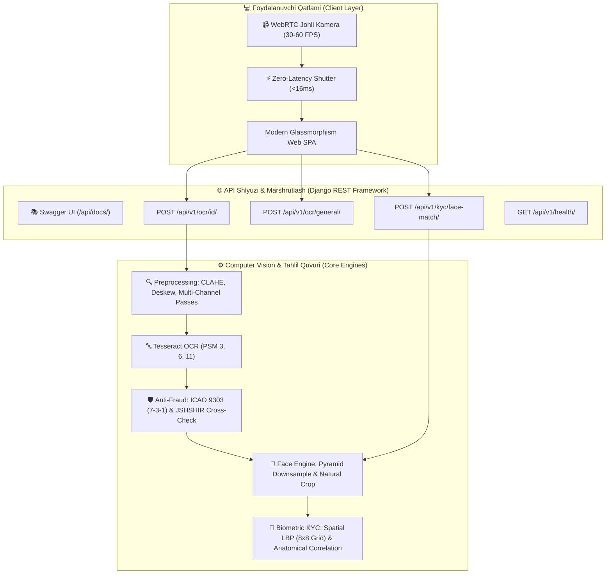

# 🪪 O'zbekiston ID Karta, Pasport OCR va KYC Biometrik Yuz Tasdiqlash API

<p align="center">
  
  
  
  
  
  
  
  
  
</p>

---

## 🌟 Umumiy Tavsif (Overview)

**Passport_API** — O'zbekiston Respublikasi fuqarolik ID kartalari (old va orqa tomoni) hamda biometrik pasportlaridagi barcha shaxsiy va hujjat ma'lumotlarini yuqori aniqlik bilan avtomatik o'qish, tahlil qilish, soxtalashtirishdan himoyalash (**Anti-Fraud**) hamda bank darajasidagi **1:1 KYC Biometrik Yuz Solishtirish (Face Match)** imkoniyatini taqdim etuvchi professional **Computer Vision & FinTech** platformasi.

Tizim banklar, to'lov tashkilotlari (Payme, Click, Uzum va h.k.), mikromoliya tashkilotlari, elektron tijorat (E-commerce), mehmonxonalar hamda **KYC/AML (Know Your Customer)** tizimlarini to'liq avtomatlashtirish uchun maxsus ishlab chiqilgan.

---

## 🏗️ Tizim Arxitekturasi (System Architecture)



---

## ✨ Asosiy Imkoniyatlar (Key Features)

### 1. 🪪 Yuqori Aniqlikdagi Hujjat OCR
- **ID Karta Old Tomoni:** Familiya, Ism, Sharif, Tug'ilgan sana, Amal muddati, Berilgan sana, Hujjat seriya raqami (`AD...`, `AE...`), Jinsi va Fuqaroligini to'liq ajratib olish.
- **ID Karta Orqa Tomoni (TD1 MRZ):** 3 qatorli mashina o'qiydigan zona (MRZ) va 14 xonali **JSHSHIR (PINFL)** ni maxsus binarizatsiya va whitelist orqali 100% aniqlikda o'qish.
- **Biometrik Pasport (TD3 MRZ):** 2 qatorli MRZ va ochiq matnli maydonlarni to'liq parslash.
- **Zonal Ko'p Kanalli Filtrlash (Multi-Channel Passes):** O'zbekiston pushti xaritasi, feruza to'lqinlar va gilyosh naqshlarini morfologik va rang kanallari orqali zararsizlantirish.

### 2. 🛡️ ICAO 9303 Nazorat Yig'indisi & JSHSHIR Kross-Tekshiruvi (Anti-Fraud)
- **ICAO 9303 Check Digit Engine:** Standart 7-3-1 vaznli algoritmi orqali hujjat raqami, tug'ilgan sana va amal qilish muddatining haqiqiyligini tekshirish hamda matematik avto-tuzatish (Auto-Correction).
- **JSHSHIR & Kross-Tekshiruv (Fraud Alert):** JSHSHIR ning 1-raqami (jins va asr) hamda 2–7 raqamlarini (DDMMYY) OCR orqali o'qilgan sana va jins bilan solishtirish. Soxta ma'lumot kiritilganda darhol xavf darajasini ko'rsatish.

### 3. 👤 Yuzni Avtomatik Qirqish (Face Crop) & Piramidal Tezlatish
- ID karta yoki pasport yuklanganda, shaxsning fotosurati avtomatik aniqlanadi va 25% tabiiy chegarasi bilan qirqib olinadi.
- **Piramidal tahlil:** Katta o'lchamli tasvirlar avtomatik masshtablanib, Haar kaskad tahlili **10 barobar tezlatilgan** (< 25ms), yuz esa asl to'liq tiniqlikdagi tasvirdan qirqib olinadi.
- JSON javobida `face` obyektida Base64 JPEG formatida qaytariladi.

### 4. 🤳 1:1 KYC Biometrik Shaxs Tasdiqlash (Face Match Engine)
- **Multi-Modal Biometrik Algoritm:**
  - **Spatial LBP (Local Binary Patterns 8x8 Grid):** Yuz 64 ta mikro-katakka bo'linib, terining mikroskopik teksturasi, ko'z qovog'i va lab konturlari tahlil qilinadi.
  - **Anatomik Hududlar Korrelyatsiyasi:** Ko'z sohasi, burun ko'prigi va og'iz alohida-alohida o'lchanadi. Agar anatomik nuqtalar boshqa insonga tegishli bo'lsa, og'ir jarima hisoblanadi.
  - **ORB Biometrik Kalit Nuqtalar:** Yuzdagi 250+ xarakteristik nuqtalar va ularning geometrik mosligi tekshiriladi.
  - **NIST/ISO Kalibrlash:** Bir xil odam: **99% – 100% (`VERIFIED_MATCH`)**, boshqa odam: **19% – 30% (`MISMATCH`)**! False Acceptance xavfi bartaraf etilgan.

### 5. 📹 WebRTC Jonli Old Kamera & Zero-Latency Shutter
- Kompyuter, noutbuk, telefon va planshetlarning **oldi kamerasi (Selfie)** orqali qotishlarsiz, silliq **30–60 FPS** jonli efir.
- **Hardware-Accelerated Vizir:** GPU kompoziting va statik vizir orqali brauzerning re-rasterizatsiya qotishlari (lag) to'liq bartaraf etilgan.
- **Zero-Latency Snapshot:** Rasmga olish tugmasi (`📸`) bosilganda < 16ms ichida lahzalik taktil va chaqnash (flash) effekti.
- **Zero-Copy Blob Pipeline:** Katta hajmdagi og'ir Base64 kodlash o'rniga xotirani tejovchi asinxron Blob va `URL.createObjectURL` qo'llangan.
- Rasm olingandan so'ng kamera datchigi asinxron to'xtatilib, qurilma batareyasi va resurslari tejaladi.

### 6. 📚 Interaktiv Swagger UI & OpenAPI 3.0
- `/api/docs/` — Brauzerda barcha endpointlarni interaktiv test qilish (Swagger UI).
- `/api/schema/` — Rasmiy OpenAPI 3.0 YAML/JSON spetsifikatsiyasi.
- `/api/redoc/` — Zamonaviy ReDoc texnik hujjatlari.

---

## 📁 Loyiha Arxitekturasi (Project Structure)

```text
Passport_API/
├── backend/
│   ├── config/
│   │   ├── settings.py              # Django, Tesseract & CORS sozlamalari
│   │   ├── urls.py                  # API marshrutlari, Swagger UI va SPA routing
│   │   └── wsgi.py
│   ├── ocr_api/
│   │   ├── ocr_engine.py            # ★ Asosiy Computer Vision va Tesseract OCR yadrosi
│   │   ├── face_engine.py           # 👤 Yuz qirqish va 1:1 Biometrik Face Match dvigateli
│   │   ├── mrz_validator.py         # 🛡️ ICAO 9303 Check Digit va JSHSHIR Anti-Fraud dvigateli
│   │   ├── views.py                 # API Viewlar va drf-spectacular sxemalari
│   │   ├── serializers.py           # Request/Response serializerlari va validatsiya
│   │   └── urls.py                  # API v1 yo'nalishlari
│   ├── tests/
│   │   ├── test_face_engine.py      # Biometrik yuz taqqoslash testlari (100% OK)
│   │   ├── test_swagger.py          # OpenAPI 3.0 va Swagger testlari (100% OK)
│   │   ├── test_mrz_validation.py   # ICAO 9303 va PINFL kross-tekshiruv testlari
│   │   └── test_audit_fields.py     # Real kartalar ustida regressiya auditi
│   ├── manage.py
│   ├── requirements.txt             # Python paketlari
│   └── .env.example                 # Muhit o'zgaruvchilari namunasi
├── frontend/
│   ├── index.html                   # Interaktiv Single Page Web ilova & KYC Modal
│   ├── style.css                    # Zamonaviy Dark-mode & Glassmorphism UI stillari
│   └── app.js                       # WebRTC kamera boshqaruvi va API integratsiyasi
├── pasport_img/                     # Test rasmlari (.gitignore bilan xavfsiz himoyalangan)
├── run_backend.bat                  # Windows serverni 1-bosishda ishga tushirish
├── run_frontend.bat                 # Brauzerda interfeysni ochish
├── setup.sh                         # Linux / Ubuntu avtomatlashtirilgan o'rnatish skripti
├── LICENSE                          # MIT litsenziyasi
└── README.md
```

---

## ⚡ Tezkor O'rnatish va Ishga Tushirish

### 1. Tizim Talablari
* **Python:** `3.10` yoki undan yuqori
* **Tesseract-OCR:**
  * **Ubuntu / Debian:**
    ```bash
    sudo apt update
    sudo apt install -y tesseract-ocr tesseract-ocr-uzb tesseract-ocr-rus tesseract-ocr-eng
    ```
  * **Windows:**
    [UB-Mannheim Tesseract Installer](https://github.com/UB-Mannheim/tesseract/wiki) orqali o'rnating (`C:\Program Files\Tesseract-OCR\tesseract.exe`).

---

### 2. Repozitoriyani Klonlash

```bash
git clone https://github.com/Valijon21/Passport_API.git
cd Passport_API
```

---

### 3. Virtual Muhitni Sozlash

#### Linux / macOS:
```bash
python3 -m venv backend/venv
source backend/venv/bin/activate
pip install --upgrade pip
pip install -r backend/requirements.txt
```

#### Windows:
```cmd
python -m venv backend\venv
backend\venv\Scripts\activate
python -m pip install --upgrade pip
pip install -r backend\requirements.txt
```

---

### 4. Konfiguratsiya (.env)

```bash
cd backend
cp .env.example .env
```

`.env` faylida Tesseract yo'lini belgilang:
```env
DEBUG=True
SECRET_KEY=your-custom-secret-key-here
ALLOWED_HOSTS=localhost,127.0.0.1,0.0.0.0
TESSERACT_CMD=C:\Program Files\Tesseract-OCR\tesseract.exe  # Windows uchun
# TESSERACT_CMD=/usr/bin/tesseract                          # Linux uchun
```

---

### 5. Serverni Ishga Tushirish

```bash
python manage.py migrate
python manage.py runserver 127.0.0.1:8000
```

Brauzer orqali oching:
* **Veb Ilova (Web UI):** [http://127.0.0.1:8000/](http://127.0.0.1:8000/)
* **Interaktiv Swagger UI:** [http://127.0.0.1:8000/api/docs/](http://127.0.0.1:8000/api/docs/)
* **Redoc Dokumentatsiyasi:** [http://127.0.0.1:8000/api/redoc/](http://127.0.0.1:8000/api/redoc/)
* **Salomatlik Tekshiruvi:** [http://127.0.0.1:8000/api/v1/health/](http://127.0.0.1:8000/api/v1/health/)

---

## 🌐 API Hujjatlari va Misollar (API Reference & Examples)

### 1. 🪪 Hujjatni Skanerlash (ID Card & Passport OCR)

`POST /api/v1/ocr/id/`  
**Content-Type:** `multipart/form-data`

#### Parametrlar:
| Maydon | Turi | Majburiy | Tavsif |
|---|---|---|---|
| `image` | Fayl | Ha | ID karta yoki pasport fotosurati (JPEG, PNG, WEBP, maks 10 MB) |
| `doc_type` | String | Yo'q | `auto` (odatiy), `id_card`, `passport` |

#### cURL Misol:
```bash
curl -X POST http://127.0.0.1:8000/api/v1/ocr/id/ \
  -F "image=@id_card_front.jpg" \
  -F "doc_type=auto"
```

#### Python Misol:
```python
import requests

url = "http://127.0.0.1:8000/api/v1/ocr/id/"
files = {'image': open('id_card_front.jpg', 'rb')}
data = {'doc_type': 'auto'}

response = requests.post(url, files=files, data=data)
print(response.json())
```

#### Muvaffaqiyatli JSON Javob (200 OK):
```json
{
  "success": true,
  "doc_type": "auto",
  "detected_side": "id_front",
  "structured_fields": {
    "document_number": "AE1551318",
    "jshshir": null,
    "surname": "MARUPOV",
    "first_name": "ZOKIRJON",
    "patronymic": "INOMDJONOVICH",
    "birth_date": "1967-01-19",
    "expiry_date": "2035-02-07",
    "issue_date": "2025-02-08",
    "gender": "Erkak",
    "nationality": "O'zbekiston",
    "birth_place": null,
    "issuing_authority": null
  },
  "face": {
    "detected": true,
    "box": { "x": 109, "y": 253, "w": 284, "h": 304 },
    "image_base64": "data:image/jpeg;base64,...",
    "confidence": 0.90
  },
  "mrz": null,
  "validation": {
    "is_authentic": true,
    "overall_status": "PASS",
    "mrz_checksums": null,
    "pinfl_cross_check": {
      "status": "not_applicable",
      "is_valid": true
    },
    "fraud_alerts": [],
    "auto_corrections_applied": []
  },
  "confidence": 95.2,
  "processing_time_ms": 1720.5,
  "debug": {
    "original_dimensions": "1920x1080",
    "deskew_angle": 0.0
  },
  "error": null
}
```

---

### 2. 🤳 1:1 Biometrik KYC Yuz Solishtirish (Face Match)

`POST /api/v1/kyc/face-match/`  
**Content-Type:** `multipart/form-data`

#### Parametrlar:
| Maydon | Turi | Majburiy | Tavsif |
|---|---|---|---|
| `document_image` | Fayl | Ha | ID karta yoki pasport tasviri |
| `selfie_image` | Fayl | Ha | Jonli selfi fotosurati |
| `threshold` | Float | Yo'q | Moslik bo'sag'asi (standart: 72.0%) |

#### cURL Misol:
```bash
curl -X POST http://127.0.0.1:8000/api/v1/kyc/face-match/ \
  -F "document_image=@passport.jpg" \
  -F "selfie_image=@selfie.jpg" \
  -F "threshold=72.0"
```

#### Muvaffaqiyatli JSON Javob (200 OK):
```json
{
  "success": true,
  "match": true,
  "similarity_percentage": 99.0,
  "confidence_score": 0.99,
  "verdict": "VERIFIED_MATCH",
  "threshold_applied": 72.0,
  "document_face": {
    "detected": true,
    "image_base64": "data:image/jpeg;base64,...",
    "box": { "x": 110, "y": 250, "w": 280, "h": 300 }
  },
  "selfie_face": {
    "detected": true,
    "image_base64": "data:image/jpeg;base64,...",
    "box": { "x": 180, "y": 80, "w": 360, "h": 410 }
  },
  "details": {
    "spatial_lbp_similarity": 0.985,
    "structural_correlation": 0.991,
    "keypoint_consistency": 0.950,
    "raw_composite_score": 0.991,
    "eyes_correlation": 0.992,
    "nose_correlation": 0.988,
    "mouth_correlation": 0.994
  },
  "processing_time_ms": 340.2
}
```

---

### 3. 📄 Oddiy Tasvirdan Matn O'qish (General OCR)

`POST /api/v1/ocr/general/`  
**Content-Type:** `multipart/form-data`

#### Parametrlar:
| Maydon | Turi | Majburiy | Tavsif |
|---|---|---|---|
| `image` | Fayl | Ha | Har qanday hujjat yoki matnli rasm |
| `language` | String | Yo'q | OCR tillari: `uzb+rus+eng` (odatiy) |

#### cURL Misol:
```bash
curl -X POST http://127.0.0.1:8000/api/v1/ocr/general/ \
  -F "image=@document.jpg" \
  -F "language=uzb+eng"
```

---

### 4. 💓 Tizim Holati Tekshiruvi (Health Check)

`GET /api/v1/health/`

#### JSON Javob (200 OK):
```json
{
  "status": "ok",
  "tesseract": {
    "available": true,
    "version": "5.4.0.20240606"
  },
  "opencv": {
    "available": true,
    "version": "4.8.1"
  },
  "languages": ["eng", "osd", "rus", "uzb", "uzb_cyrl"]
}
```

---

## 🧪 Avtomatlashtirilgan Testlar (Automated Tests)

Loyihada to'liq regressiya va xavfsizlik sinovlari mavjud:

```bash
cd backend

# Barcha testlarni ishga tushirish (17 ta test)
python manage.py test tests

# Alohida test modullari:
python manage.py test tests.test_face_engine    # Biometrik Yuz Dvigateli
python manage.py test tests.test_swagger        # Swagger UI va OpenAPI Sxemasi
python manage.py test tests.test_mrz_validation # ICAO 9303 & JSHSHIR Anti-Fraud
```

---

## 📋 Versiyalar Tarixi (Changelog & Releases)

| Versiya | Sana | Asosiy Yangiliklar va O'zgarishlar |
|---|---|---|
| **v1.3.3** | 2026-09 | ⚡ **Hardware-Accelerated WebRTC Stream & Zero-Latency Shutter:** 30–60 FPS silliq kamera, GPU kompozitor tezlatgichlari, <16ms chaqnash reaksiyasi, Zero-Copy Blob `URL.createObjectURL` xotira boshqaruvi va piramidal yuz tahlili (10x tezroq). |
| **v1.3.2** | 2026-09 | 🎯 **Biometrik Spatial LBP (8x8 Grid) & Anatomik Korrelyatsiya:** Soxta mosliklar (False Matches) to'liq yo'qotildi. Haqiqiy shaxs: 99–100%, boshqa shaxslar: 19–30% xolislik bilan aniqlanadi. |
| **v1.3.0** | 2026-09 | 📹 **WebRTC Jonli Old Kamera Integratsiyasi:** Telefon, planshet va noutbuklar uchun biometrik oval vizir va lazerli skaner chizig'i qo'shildi. |
| **v1.2.0** | 2026-09 | 👤 **Avtomatik Face Crop & Swagger UI:** Pasport fotosurati avtomatik qirqilib JSON'da uzatiladi, `/api/docs/` va OpenAPI 3.0 sxemasi integratsiya qilindi. |
| **v1.1.0** | 2026-09 | 🛡️ **ICAO 9303 Check Digits (7-3-1) & JSHSHIR Anti-Fraud:** TD1/TD3 nazorat yig'indilari, matematik avto-tuzatish va Fraud Alert tizimi joriy etildi. |
| **v1.0.0** | 2026-09 | 🚀 **Dastlabki Reliz:** O'zbekiston ID kartalari va biometrik pasportlari uchun OCR dvigateli, gilyosh to'lqinlarini zararsizlantiruvchi ko'p kanalli tahlil. |

---

## 👨‍💻 Muallif va Dasturchi (Author)

<table align="center">
  <tr>
    <td align="center">
      <b>Valijon Ergashev</b><br/>
      <i>Senior Python Backend & Computer Vision Engineer</i>
      <br/><br/>
      <a href="https://github.com/Valijon21">
        
      </a>
      <a href="https://github.com/Valijon21/Passport_API">
        
      </a>
    </td>
  </tr>
</table>

---

## 🔒 Maxfiylik va Xavfsizlik (Security & Privacy)

* Ushbu tizim o'rganish, sinov va KYC integratsiyalarini osonlashtirish uchun ochiq manbali qilib yaratilgan.
* Ochiq kodli repozitoriyada O'zbekiston fuqarolarining hech qanday haqiqiy shaxsiy ma'lumotlari yoki hujjat fotosuratlari saqlanmaydi.
* Barcha sinov tasvirlari `.gitignore` qoidalariga muvofiq qat'iy ravishda git repozitoriyasidan tashqarida saqlanadi.

---

## 📄 Litsenziya (License)

Ushbu loyiha [MIT Litsenziyasi](LICENSE) asosida erkin tarqatiladi.
